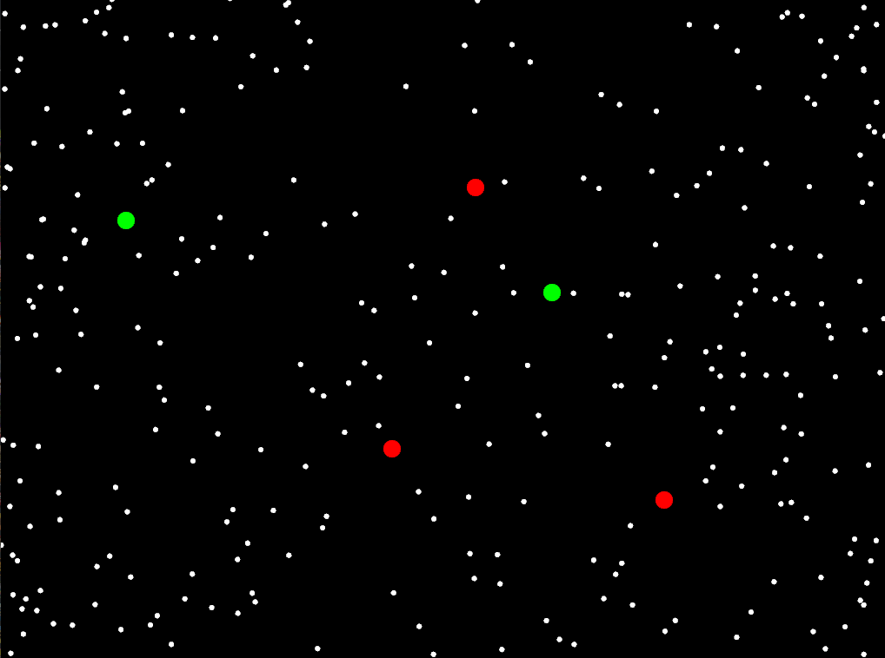

# Reto
[Link codigo](https://upbeduco-my.sharepoint.com/:f:/g/personal/lorenzo_perezs_upb_edu_co/Egi5vS4o-LdFjkWG4-TLU7cBE-bHy7eGaUV9wKvdl6cAZA?e=IaQgFB)  
## Prompt ChatGPT 
¿Puedes ayudarme a diseñar un proyecto de arte generativo en C++ utilizando openFrameworks que utilice encapsulamiento, herencia y polimorfismo? Quiero implementar un sistema de partículas con diferentes comportamientos.  
Quiero hacer uno que haya multiples particulas aleatorias en la pantalla y dependiendo del click que hagas aparesca una particula repulsora y con otro click una atractora.  
Ayuda para hecer un wrapping.  

## Funcion Codigo  
Aparecen un numero dado de particulas con velocidades aleatorias, Click derecho crea una particula repulsora roja, mientras que el click izquierdo genera una particula atractora verde, presionar 'h' hace que las particulas de fuerza no sean visibles.  

