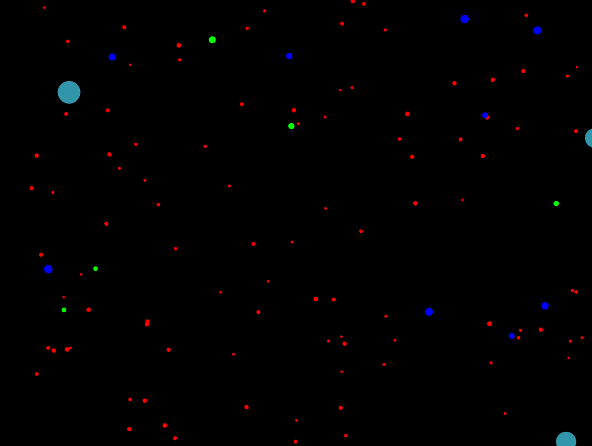
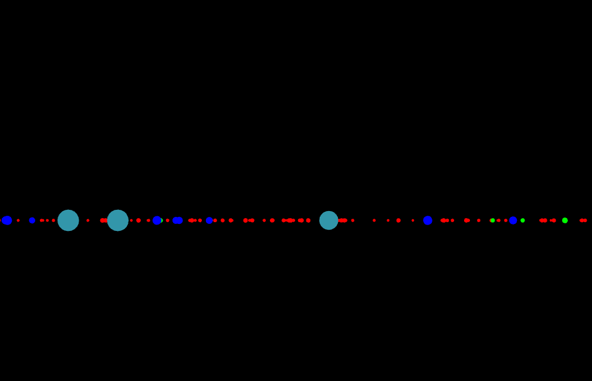
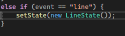
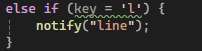

# Sesión 2

## Analizis
- **¿Qué hace el patrón observer en este caso?**  
  Espera hasta recibir un input del teclado para mandar una notificacion a los objetos que hereden del observer en esta caso las particulas.
- **¿Qué hace el patrón factory en este caso?**  
  Hay una fabrica que crea todas las particulas dependiendo de cual se eligio.
- **¿Qué hace el patrón state en este caso?**  
  Cuando se le notifica al observer, el estado cambia a una nueva instancia del estado al que se esta cambiando, son los estados los que cambian el movimiento de las particulas.
## Experimentación
- **Adiciona un nuevo tipo de partícula**  
  
  
- **Adiciona un nuevo estado**  
  Un estado que hace que las particulas sigan su movimiento pero en una linea en la mitad de la ventana.  
  ```cpp
  void LineState::update(Particle* particle) {
	particle->position.y = ofGetHeight() / 2;
	particle->position.x += particle->velocity.x;
  }
  ```  
  
- **Modifica el comportamiento de las partículas**  
  Hice que las particulas hicieran wrapping.  
  
- **Crea otros eventos para notificar a las partículas**  
  Para la creacion del estado use el sistema de notificaciones  
    
    
