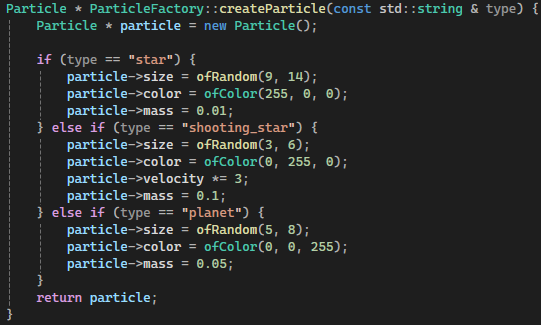
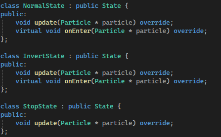

# Reto

## Como se implementa cada patron:

- **Factory**  
    
  Una fabrica para todas las particulas, dependiendo del boton del mouse que se oprima aparecera una particula diferente, la particula _"Star"_ no es afectada por el observer asi que no puede notificar para cambiar de estados como las otras.
- **Observer**  
  Las particulas esperan hasta ser notificadas con un cambio de estado, esto pasa cuando se preciona alguna de las teclas _(i,n,s)_.
- **State**  
    
  Los diferentes estados, el estado _normal_ aplica gravedad normal a las particulas, el estado _invert_ aplica gravedad invertida a las particulas y el estado _stop_ las detiene.

## Video demostracion
[Link video](https://upbeduco-my.sharepoint.com/:v:/g/personal/lorenzo_perezs_upb_edu_co/EdAXOKFdqwtLv96lsZyH2IIBvPqWFw1ub8lIaRhkd8r00A?nav=eyJyZWZlcnJhbEluZm8iOnsicmVmZXJyYWxBcHAiOiJPbmVEcml2ZUZvckJ1c2luZXNzIiwicmVmZXJyYWxBcHBQbGF0Zm9ybSI6IldlYiIsInJlZmVycmFsTW9kZSI6InZpZXciLCJyZWZlcnJhbFZpZXciOiJNeUZpbGVzTGlua0NvcHkifX0&e=BcGczZ)